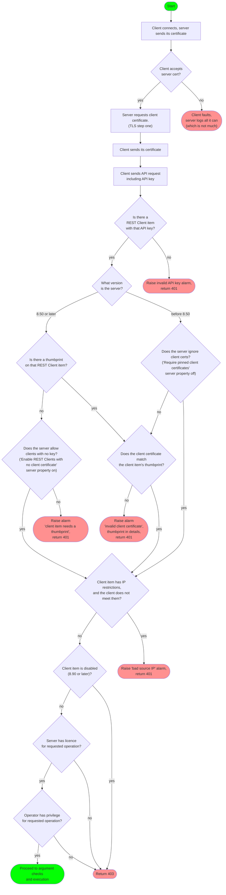

```mermaid
---
title
---
flowchart TD

  classDef red fill:#ff9090
  o_noapikey([Raise invalid API key alarm,\nreturn 401]):::red
  o_needacert(["Raise alarm\n'client item needs a thumbprint',\nreturn 401"]):::red
  o_badprint(["Raise alarm\n'invalid client certificate',\nthumbprint in details,\nreturn 401"]):::red
  o_badip(["Raise 'bad source IP' alarm,\nreturn 401"]):::red
  o_disabled(["Return 403"]):::red
  o_clientquit(["Client faults,\nserver logs all it can\n(which is not much)"]):::red

  op1["Client connects, server sends its certificate"]
  o_reqclientcert["Server requests client certificate.\n(TLS step one)"]
  o_clientsendscert["Client sends its certificate"]
  o_clientreq["Client sends API request\nincluding API key"]

  o_argcheck(["Proceed to argument checks\nand execution"])
  style o_argcheck fill:#04ff04

  cond{"Client accepts\nserver cert?"}
  c_apikeycheck{"Is there a\nREST Client item\nwith that API key?"}
  c_versioncheck{"What version\nis the server?"}
  c_clientcertcheck1{"Is there a thumbprint\non that REST Client item?"}
  c_clientcertcheck2{"Does the server allow clients with no key?\n('Enable REST Clients with no client certificate'\nserver property on)"}

  c_clientcertcheck840{"Does the server ignore client certs?\n('Require pinned client certificates'\nserver property off)"}

  c_correctcert{"Does the client certificate match\nthe client item's thumbprint?"}
  c_sourceip{"Client item has IP restrictions,\nand the client does not meet them?"}
  c_disabled{"Client item is disabled\n(8.90 or later)?"}
  c_licence{"Server has licence\nfor requested operation?"}
  c_privcheck{"Operator has privilege\nfor requested operation?"}


  start([Start]) --> op1
  style start fill:#04ff04
  op1-->cond
  cond--yes-->o_reqclientcert
  cond-- no -->o_clientquit
  o_reqclientcert --> o_clientsendscert
  o_clientsendscert --> o_clientreq
  o_clientreq --> c_apikeycheck

  c_apikeycheck -- yes --> c_versioncheck
  c_apikeycheck -- no --> o_noapikey

  c_versioncheck -- 8.50 or later --> c_clientcertcheck1
  c_versioncheck -- before 8.50 --> c_clientcertcheck840

  c_clientcertcheck1-- no -->c_clientcertcheck2

  c_clientcertcheck840-- no -->c_correctcert
  c_clientcertcheck840-- yes -->c_sourceip

  c_clientcertcheck2-- yes --->c_sourceip
  c_clientcertcheck2-- no -->o_needacert

  c_correctcert-- no -->o_badprint
  c_clientcertcheck1-- yes -->c_correctcert

  c_correctcert-- yes --->c_sourceip
  c_sourceip-- no -->c_disabled
  c_sourceip-- yes -->o_badip

  c_disabled-- no -->c_licence
  c_disabled-- yes -->o_disabled

  c_licence-- yes -->c_privcheck
  c_licence-- no -->o_disabled
  c_privcheck-- yes -->o_argcheck
  c_privcheck-- no -->o_disabled

```
